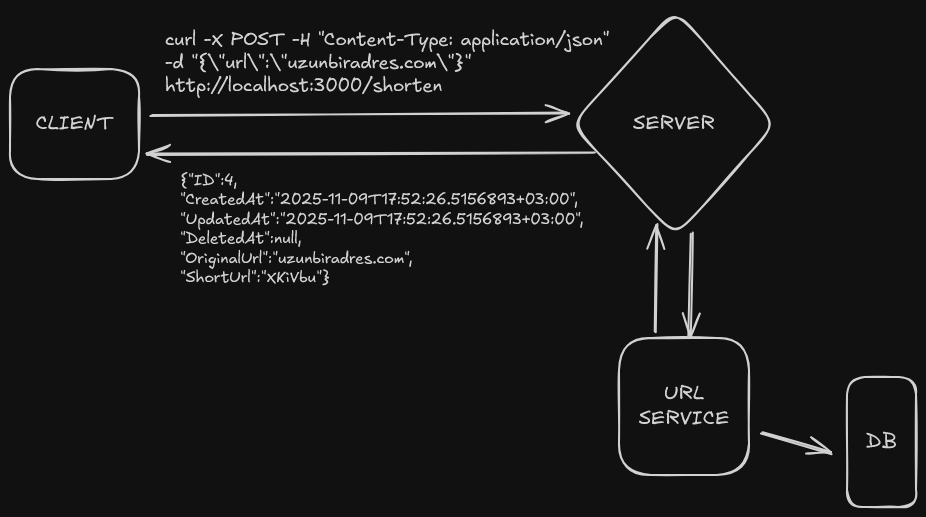
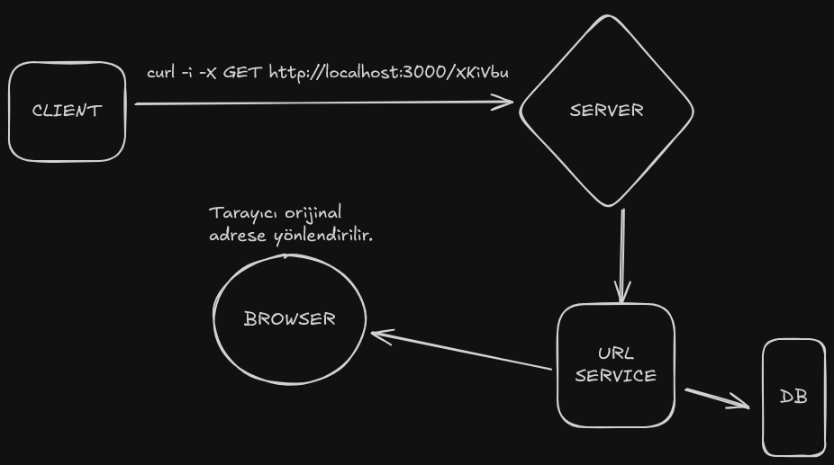

### URL KISALTMA

Go ile http server öğrenmek için yazılmış basit bir URL kısaltma servisi.

---

### KURULUM

1. Repoyu local'e çek.
   ` git clone https://github.com/msinandemir/url-shorten-go.git`
2. Docker compose dosyasını çalıştır.
   `docker compose up -d`
3. Bağımlılıkları yükle.
   `go mod download`
4. Ana dizindeki main.go dosyasını çalıştır.
   `go run main.go`

---

### API ENDPOINTS

1. URL Kısaltma:
   Bu endpoint uzun bir URL'yi kısaltır ve veritabanına kayıt eder. Veritabanına kayıt ettiği nesneyi geri döner.

- **Metot:** `POST`
- **URL:** `http://localhost:3000/shorten`
- **İstek Gövdesi:** Kısaltılacak URL'yi json objesi ile **url** anahtarıyla gönderin.
- **Başarılı Yanıt:** İstek başarılı olursa kısaltılmış URL 201 kodu ile dönülür.
- **Hata Yanıtı:** İstek başarısız olursa 400 kodu ile hata mesajı dönülür.
  

---

2. Orijinal URL'ye Yönlendirme:
   Bu endpoint verilen kısa kodu veritabanında sorgular eğer bir sonuç bulursa 301 koduyla yönlendirme yapar.

- **Metot:** `GET`
- **URL:** `http://localhost:3000/:shorten-url`
- **Parametre:** `:short-url` Veritabanında kayıtlı olan kısa kod (XKiVbu gibi).
- **Başarılı Yanıt:** Tarayıcı sunucudan aldığı bu yanıt ile otomatik olarak orijinal adrese yönlendirilir.
- **Hata Yanıtı:** İstek başarısız olursa 400 kodu ile hata mesajı dönülür.
